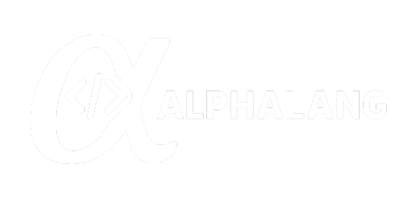

# 📚 Deliverables – Programming Language Final Year Project - AlphaLang

This repository contains **all official documents** related to my final-year project: the design and implementation of a custom educational programming language.

---

## 📄 List of Documents

| File Name                    | Description                                                                 |
|-----------------------------|-----------------------------------------------------------------------------|
| [`dev_report.md`](./dev_report.md) | Development report detailing all considered ideas, the selected MVP, and project organization. |
| [`project_charter.md`](./project_charter.md) | Defines the Project Charter for Alphalang, detailing its goals, stakeholders, scope, risks, and development timeline to guide the creation of a multilingual programming language for beginners. |

---

## 🧭 How to Use

Each document is self-contained, but the recommended reading order is:

1. **[`dev_report.md`](./dev_report.md)** – Start here to understand the origin and rationale behind the project.
2. **[`project_charter.md`](./project_charter.md)** – The Project Charter outlines Alphalang's objectives, scope, and development plan.

---

## 👤 Author

Solo project developed as part of my final year in software engineering.

---

## 📅 Project Context

This project is part of a final-year module focused on **language design**, **interpreter implementation**, and **technical communication** for a self-designed software product.
