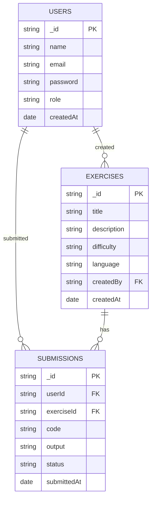
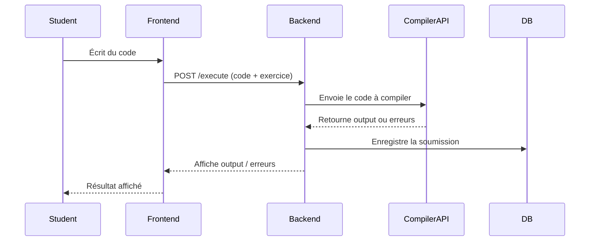
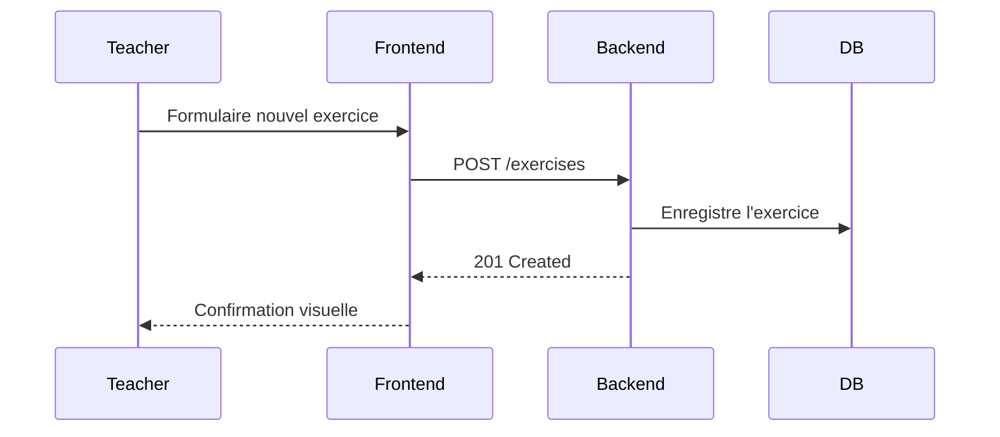

# 📘 AlphaLang – MVP Specification Document
## 1. 🧩 User Stories and Mockups
### 🎯 Purpose
Identifier les besoins utilisateurs prioritaires et représenter visuellement l'interface du MVP.

### ✅ Prioritized User Stories (MoSCoW)
#### Learner
- Must Have

 - As a learner, I want to write and run AlphaLang code in my browser, so that I can practice coding without installing anything.

 - As a learner, I want to choose my preferred language (e.g., French, English), so that I can understand syntax and errors better.

 - As a learner, I want to see syntax highlighting and auto-completion, so that I can code more efficiently.

- Should Have

 - Access tutorials.

 - Real-time feedback on code.

- Could Have

 - Share code by URL.

#### Teacher
- Must Have

 - Create guided exercises with expected outputs.

- Should Have

 - Track learner progress.

#### Developer
- Must Have

 - Contribute new syntax/keywords by language.

### 🎨 Mockups (à réaliser dans Figma ou autre)
 - Code Editor Interface (multilingue, output intégré)

 - Tutorials/Exercise View

 - Language & Role Selection Screen

## 2. 🏗️ System Architecture
### 🎯 Purpose
Assurer une architecture modulaire, évolutive et performante.

### 🖼️ High-Level Diagram
```plaintext
[ Front-End (React) ]
        |
        v
[ API Gateway (Node.js/Express) ]
        |
        v
[ Database (PostgreSQL) ] <--> [ ORM (Prisma/Sequelize) ]
        |
        v
[ Auth Service (JWT + OAuth2) ]
```
*Flux de données :*

 - Le front-end envoie du code à l’API → L’API passe à l’exécuteur (sandbox) → Résultat renvoyé → Stockage en base si exercice.

## 3. 🧱 Components, Classes, and Database Design
### ⚙️ Back-End – Classes principales
`ExerciseController`
 - `createExercise()`, `evaluateCode()`, `getExercisesByUser()`

`LangCompilerService`
 - `translateToInternalSyntax(code, lang)`

 - `execute(codeTranslated)`

`UserService`
 - `registerUser()`, `getProfile()`, `trackProgress()`

### 🗃️ Database (PostgreSQL – Relational)
**Users**
 - id (PK), email, name, role

**Exercises**
 - id (PK), title, description, expected_output, language

**Submissions**
 - id (PK), user_id (FK), exercise_id (FK), submitted_code, output, score

**Languages**
 - id (PK), name, syntax_map (JSONB)

## 4. 📤 Sequence Diagrams
### 🧪 Use Case 1: Learner runs code
```plaintext
User → Front-End → API Gateway → LangCompilerService → Docker Sandbox
               ← result ←          ←          ←
```
### 🧪 Use Case 2: Teacher creates an exercise
```plaintext
Teacher → Front-End → API Gateway → ExerciseController → Database
```
## 5. 📡 API Specifications

### Internal REST API Endpoints
Endpoint | Method | Description
`/api/execute` | POST | Exécute le code AlphaLang
`/api/exercises` | GET/POST | Récupère ou crée des exercices
`/api/submissions` | POST | Soumet un code et renvoie le résultat
`/api/user` | GET/PUT | Profil utilisateur

## 6. 🧪 SCM and QA Plans
### 🔀 SCM Strategy
- Branches : `main` (prod), `staging`, `feature/*`

- Process :

 - Commit en anglais, clairs et concis.

 - Revue obligatoire via Pull Request avant merge sur dev.

### ✅ QA Strategy
- Unit Tests : Jest (front), Mocha/Chai (back)

- Integration Tests : Supertest

- Manual QA : tests manuels sur les parcours critiques

- CI/CD Pipeline : GitHub Actions + Netlify (front) / Render (back)

## 7. 🧠 Technical Justifications
Choix | Justification
React | Large communauté, écosystème riche, support multilingue facile
Node.js + Express | Léger, performant, simple à scaler pour API
PostgreSQL | Excellente gestion relationnelle et support JSONB pour syntaxes
JWT Auth | Standard sécurisé et facilement extensible
Figma/Balsamiq | Outils rapides pour les wireframes


### 8. 📊 Diagrams

```mermaid
graph TD
    A[Frontend (React)] -->|HTTP Requests| B[Backend (Node.js + Express)]
    B -->|CRUD| C[(MongoDB)]
    B -->|Call| D[External APIs (e.g., Compiler API)]
    A -->|WebSocket (Realtime)| B
```




